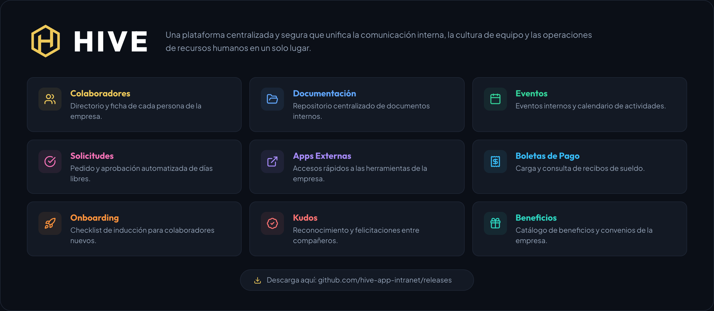

# HIVE



HIVE es la intranet de tu empresa: un solo lugar para enterarte de las novedades, encontrar a un compañero, pedir tus días libres, revisar tus boletas de pago y tener a mano los documentos y beneficios de la empresa — sin depender de correos sueltos ni carpetas compartidas.

En este repositorio encontrarás las versiones publicadas de HIVE y el historial de cambios. La rama `main` de este repo es solo esta página y el changelog — cada versión publicada vive en su propio tag, aislado, sin historial mezclado con las demás.


## Sobre el producto (Beta)

Esta etapa de HIVE todavía está en modo de pruebas: cada instalación se distribuye con una licencia interna, generada automáticamente durante el proceso de setup, que habilita todos los módulos disponibles en esta versión sin restricciones. Más adelante, algunos módulos pasarán a requerir una licencia específica.


## Instalación

Descargá la última versión publicada:

```bash
git clone --branch v0.1.0 --depth 1 https://github.com/hive-app-intranet/releases.git hive
```

Reemplazá `v0.1.0` por el tag que quieras — mirá la pestaña [Releases](../../releases) para ver cuál es el más reciente. Una vez descargada, seguí los pasos de instalación del `README.md` incluido en esa carpeta.

## Documentación

La documentación se encuentra en el paquete de instalación — leé su README para más información.

## Reportar un bug

[Abrí un issue](../../issues/new) con la versión que estás corriendo y los pasos para reproducirlo. No compartas datos sensibles — es un repo público.

## Licencia

Ver [LICENSE.md](./LICENSE.md).
